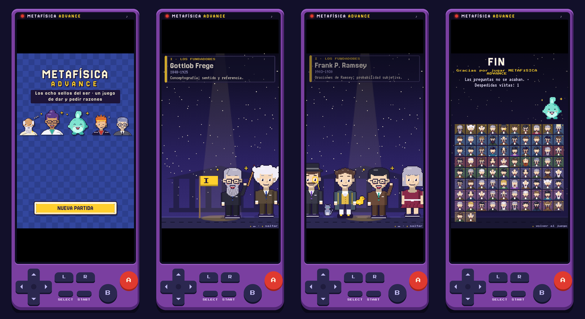
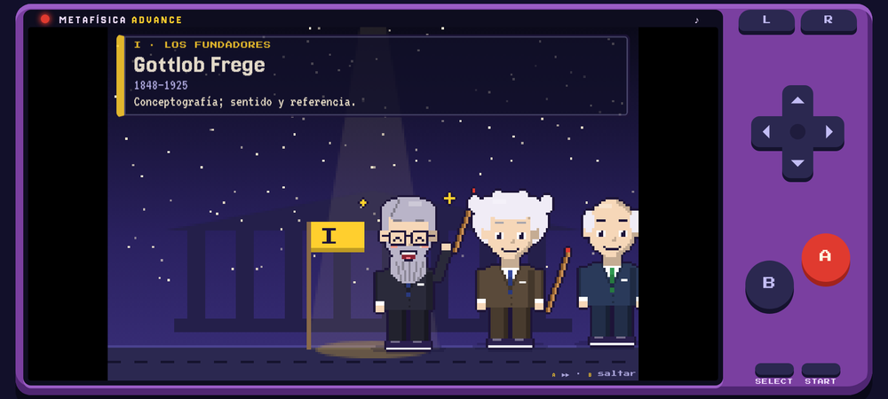

# Metafísica Advance · APK para Android

**Adaptación Android** de [Metafísica Advance](https://github.com/ontoterrorist/metafisica-advance), el juego de rol con aspecto de consola portátil para aprender metafísica creado por [@ontoterrorist](https://github.com/ontoterrorist). Este repositorio lo empaqueta como **aplicación instalable (APK)** que funciona sin conexión, conserva la partida y añade una despedida animada con los lógicos y filósofos analíticos del siglo XX.

> El juego, sus textos, gráficos, música y personajes son obra de su autor original. Esta adaptación solo añade la carpeta [`APK/`](APK/). Ver [CREDITOS.md](CREDITOS.md) · [Jugar en el navegador](https://ontoterrorist.github.io/metafisica-advance/)



## ⬇️ Descargar e instalar

1. Ve a **[Releases](../../releases/latest)** y descarga el archivo `.apk` en el teléfono.
2. Ábrelo. Android pedirá permitir **Instalar apps desconocidas** para la app con la que lo abriste (Archivos, Chrome, Drive…): actívalo y vuelve atrás.
3. Si **Play Protect** avisa de que la app es desconocida, toca *Más detalles → Instalar de todas formas*.

| Requisito | |
|---|---|
| Android | 7.0 o superior (probado para Android 13) |
| Espacio | ≈ 5 MB |
| Internet | No necesario |
| Permisos | Ninguno especial |

> Para actualizar, instala el APK nuevo encima del anterior: la partida se conserva. Si **desinstalas** la app, Android borra la partida.

## Qué trae la versión APK

| | PWA original (navegador) | Este APK |
|---|---|---|
| Instalación | Desde Chrome, con la web abierta | Archivo que se comparte por Releases, Drive o WhatsApp |
| Sin conexión | Tras la primera visita | Desde el primer momento |
| Memoria | Almacenamiento del navegador | Igual **más una copia nativa** de Android que la restaura si se borran los datos |
| Guardado al salir | Al cambiar de escena | También al minimizar o cerrar la app |
| Botón atrás | Sale de la web | Funciona como **B**; en la portada, dos veces para salir |
| Pantalla | La del navegador | Completa e inmersiva, siempre encendida mientras juegas |
| Despedida y código secreto | — | ✔ |

La consola se conserva tal cual: pantalla, cruceta, **A**, **B**, **L**, **R**, **START** y **SELECT** son táctiles y jugables, en vertical y en apaisado.



## 🔑 Código secreto

En cualquier momento, con los botones de la consola:

<p align="center"><b>← &nbsp;→ &nbsp;← &nbsp;→ &nbsp;A &nbsp;B &nbsp;A &nbsp;B &nbsp;←</b></p>

(máximo 3 segundos entre pulsaciones; también funciona con el teclado: flechas, **Z** = A, **X** = B)

Abre la **despedida**, que también aparece por sí sola al **vencer a Carnap**, al final del juego.

##  La despedida

Un desfile nocturno frente al ágora: 82 lógicos y filósofos analíticos del siglo XX pasan bajo el foco, cada uno con su retrato pixelado, sus fechas y su aporte principal, agrupados en siete escuelas con su estandarte y con música propia. Termina con una foto de grupo y Ousía.

| | Escuela | Algunos de sus integrantes |
|---|---|---|
| I | Los fundadores | Frege, Russell, Whitehead, Moore, Wittgenstein, Ramsey, Stebbing |
| II | Lógica matemática | Hilbert, Gödel, Church, Turing, Gentzen, Kleene, Julia Robinson |
| III | Escuela de Lwów–Varsovia | Twardowski, Łukasiewicz, Leśniewski, Tarski |
| IV | Círculo de Viena y Berlín | Schlick, Neurath, Carnap, Reichenbach, Hempel, Popper, Ayer |
| V | Oxford y Cambridge | Ryle, Austin, Grice, Prior, Anscombe, Strawson, Foot, Dummett, Parfit |
| VI | Norteamérica | Quine, Goodman, Sellars, Davidson, Barcan Marcus, Putnam, Kripke, David Lewis |
| VII | Australia | Smart, Place, Armstrong |

| Botón | Durante la despedida |
|---|---|
| **A** o tocar la pantalla | Acelera ×4 (otra vez: velocidad normal) |
| **B** | Salta a la foto final |
| **START** | Sale |
| **A** en la foto final | Vuelve al juego |

La app recuerda cuántas despedidas has visto.

## Compilar el APK tú mismo

Requisitos: **Node.js 22+**, **Android Studio** (SDK con Android 16 / API 36) y **JDK 21**.

```powershell
cd APK
npm install
npm run sync
```

Luego, en Windows, doble clic en **`APK/build-apk.bat`**: busca solo el JDK 21 y el Android SDK y deja `MetafisicaAdvance-debug.apk` en la carpeta `APK`. También puedes abrir `APK/android` en Android Studio y usar *Build → Build APK(s)*.

Guía completa paso a paso, APK firmado (*release*) y solución de problemas: **[APK/GUIA_INSTALACION.md](APK/GUIA_INSTALACION.md)**.

### Cómo está hecho

```
index.html, icons/        ← juego original, sin tocar
APK/
├─ src/                   ← código de la adaptación
│  ├─ apk-boot.js         ← memoria nativa (Capacitor Preferences)
│  ├─ apk-extras.js       ← código secreto, despedida, botón atrás, guardado al salir
│  └─ apk.css             ← estilos de la despedida
├─ scripts/sync-game.mjs  ← copia ../index.html a www/ y aplica 7 parches
├─ android/               ← proyecto Android (Capacitor 8): pantalla completa, icono, arranque
└─ build-apk.bat          ← compilación en un clic (Windows)
```

El `index.html` original no se edita: `sync-game.mjs` lo copia y le añade los ganchos necesarios (botones, final del juego, canción de despedida). Si el juego original se actualiza, basta con reemplazar `index.html` y volver a compilar.

## Créditos

- **Juego original:** [Metafísica Advance](https://github.com/ontoterrorist/metafisica-advance) © [@ontoterrorist](https://github.com/ontoterrorist).
- **Adaptación Android:** [RonaldPort](https://github.com/RonaldPort).
- Construido con [Capacitor](https://capacitorjs.com).
